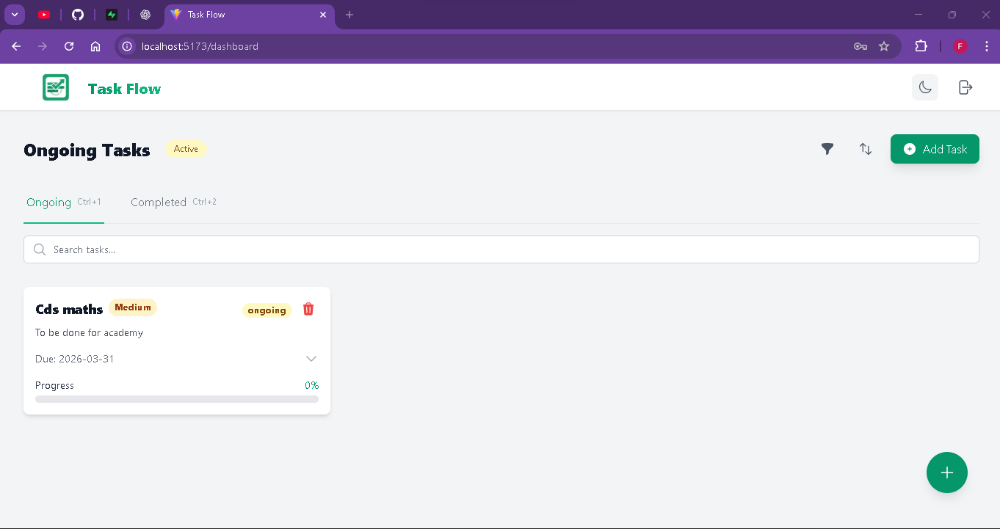
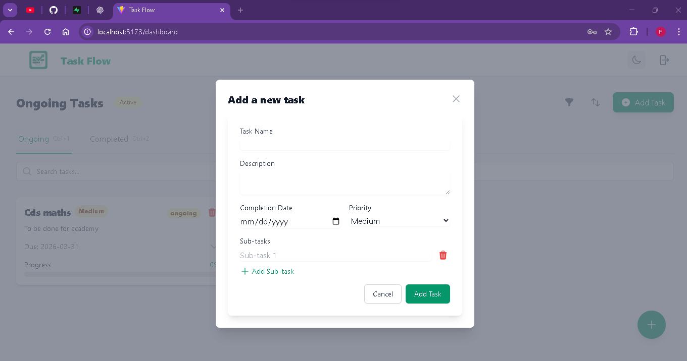
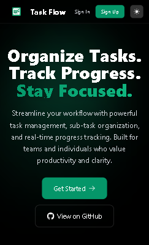
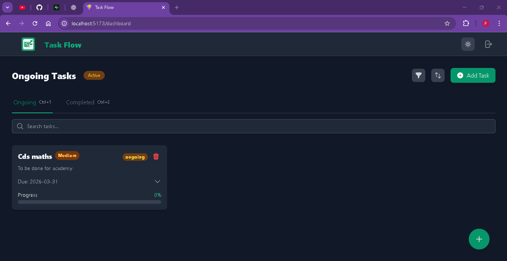
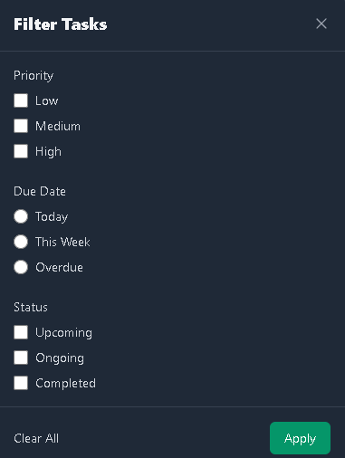
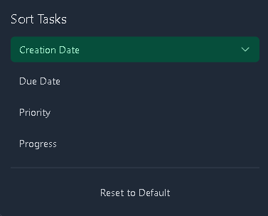

# TaskFlow - Task Management Application


TaskFlow is a modern, responsive task management application built with cutting-edge technologies. It helps users organize their tasks with features like priority levels, due dates, progress tracking, and smart filtering.

## Features

- 📋 **Task Management**: Create, read, update, and delete tasks with sub-tasks
- ⚡ **Real-time Updates**: Instant synchronization with Supabase backend
- 🎨 **Responsive Design**: Works seamlessly on desktop, tablet, and mobile devices
- 🌙 **Dark Mode**: Eye-friendly dark theme support
- 🔍 **Advanced Filtering**: Filter tasks by priority, due date, and status
- 🔀 **Smart Sorting**: Sort tasks by due date, priority, progress, or creation date
- 🚀 **Quick Add**: Floating action button for rapid task creation
- ⌨️ **Keyboard Shortcuts**: Efficient navigation and task management
- 🔒 **Secure Authentication**: User authentication with Supabase Auth

## Tech Stack

- **Frontend**: React 19, React Router v7
- **Styling**: Tailwind CSS v3.4
- **UI Components**: Headless UI, Heroicons
- **Backend**: Supabase (Database, Auth, Real-time)
- **Build Tool**: Vite 7
- **Deployment**: Ready for deployment on any static hosting platform

## Getting Started

### Prerequisites

- Node.js (v16 or higher)
- npm or yarn
- Supabase account for backend services

### Installation

1. Clone the repository:
   ```bash
   git clone https://github.com/abhinavsaxena2308/ToDoMaster
   cd todomaster
   ```

2. Install dependencies:
   ```bash
   npm install
   ```

3. Set up environment variables:
   Create a `.env` file in the root directory with your Supabase credentials:
   ```env
   VITE_SUPABASE_URL=your_supabase_url
   VITE_SUPABASE_ANON_KEY=your_supabase_anon_key
   ```

4. Run the development server:
   ```bash
   npm run dev
   ```

5. Build for production:
   ```bash
   npm run build
   ```

## Key Features Details

### Task Priority System
Tasks can be assigned priority levels:
- **Low** (Gray)
- **Medium** (Yellow)
- **High** (Red)

### Smart Task Handling
- Automatically moves tasks from "upcoming" to "ongoing" when due date arrives
- Highlights overdue tasks with visual indicators
- Tracks progress through sub-tasks

### Advanced UI Controls
- **Filter Panel**: Filter by priority, due date (Today, This Week, Overdue), and status
- **Sort Panel**: Sort by creation date, due date, priority, or progress
- **Search**: Real-time search through task titles and descriptions

### Responsive Design
- Mobile-first approach with touch-friendly controls
- Adapts to all screen sizes from 320px width and up
- Consistent experience across devices

## Screenshots

### Dashboard View

*Main dashboard showing ongoing tasks with priority indicators*

### Task Creation

*Task creation modal with priority selection and sub-tasks*

### Mobile View

*Responsive design optimized for mobile devices*

### Dark Mode

*Dark theme support for comfortable nighttime use*

### Filter and Sort Options

*Advanced filtering by priority, due date, and status*


*Flexible sorting options for task organization*

## Keyboard Shortcuts

- `Ctrl+N`: Open add task modal
- `Ctrl+1`: Switch to ongoing tasks
- `Ctrl+2`: Switch to completed tasks
- `Escape`: Close modals

## License

This project is licensed under the MIT License - see the [LICENSE](LICENSE) file for details.

## Acknowledgments

- [React](https://reactjs.org/) - Frontend library
- [Supabase](https://supabase.io/) - Backend-as-a-Service
- [Tailwind CSS](https://tailwindcss.com/) - Utility-first CSS framework
- [Vite](https://vitejs.dev/) - Next generation frontend tooling